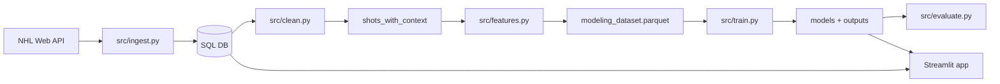

# White Paper: NHL Expected Goals (xG) — End-to-End Analytics Platform

**Scope:** Data acquisition, relational storage, interpretable modeling, time-based evaluation, and interactive exploration.

---

## 1. Executive summary

This project implements a **complete pipeline** from public National Hockey League (NHL) play-by-play data to **shot-level expected goals (xG)**: calibrated goal probabilities that summarize **where and how** shots occur, separate from **whether** the puck entered the net on a given attempt.

The design priorities are:

1. **Reproducibility** — fixed API contracts, documented coordinate conventions, and versioned SQL feature logic.  
2. **Honest evaluation** — a **strict time-based** train and test split (no random shuffling within a season).  
3. **Interpretability** — logistic regression on transparent features, with exported coefficients and diagnostic plots.  
4. **Usability** — a **Streamlit** application for league, team, and player views over modeled shots.

The system is suitable for **education**, **portfolio demonstration**, and as a **baseline** for more complex models (gradient boosting, neural nets, or league-specific calibrations).

---

## 2. Problem statement

### 2.1 Why expected goals?

Raw shot counts treat a perimeter wrist shot and a slot one-timer as equal. In reality, **spatial context**, **game situation**, and **sequence effects** (e.g., rebounds, transition) strongly influence goal probability. xG assigns each eligible attempt a probability in \([0, 1]\) so that:

- **Process** (chance quality and volume) can be compared to **results** (goals), which are noisy over small samples.  
- Coaches, analysts, and fans can reason about **finishing variance** (goals minus xG) without conflating luck with skill on every shot.

### 2.2 Project goals

| Goal | Implementation |
|------|----------------|
| Ingest multi-season regular-season data | `src/ingest.py` against NHL Web API |
| Persist structured events and shots | `sql/schema.sql` + SQLite or PostgreSQL |
| Encode temporal and tactical context in SQL | `sql/shot_context_features.sql` |
| Normalize rink geometry and build model features | `src/features.py` |
| Train and persist a baseline classifier | `src/train.py` (scikit-learn pipeline) |
| Quantify out-of-time performance | `src/evaluate.py` + held-out calendar window |
| Communicate results interactively | `app/streamlit_app.py` |

Non-goals for the baseline: real-time betting feeds, proprietary tracking (e.g., optical player speeds), or shooter-specific priors beyond what appears in the public event stream.

---

## 3. Data sources and legal context

### 3.1 Sources

- **Schedule and game discovery** — `https://api-web.nhle.com/v1/schedule/{date}`  
- **Play-by-play** — `https://api-web.nhle.com/v1/gamecenter/{game_id}/play-by-play`  
- **Optional player names** — NHL landing / legacy people endpoints (see `src/utils.py`, `src/clean.py`)

### 3.2 Shot universe (Fenwick-style)

The modeling population is **unblocked shot attempts**: API event types `shot-on-goal`, `missed-shot`, and `goal`. Blocked shots are excluded to align with common public analytics definitions and to reduce dependence on block location quality.

### 3.3 Attribution

NHL data is © NHL. This repository is intended for **educational and portfolio** use. Operators should respect **rate limits** and terms of service of the public APIs.

---

## 4. System architecture

High-level flow:

- **Ingestion** writes **games**, **events**, and **shots** (and optionally **players**).  
- **SQL** materializes **context** (rebounds, rush heuristics, joins to game metadata).  
- **Features** merge SQL output with **geometry** (distance, angle, strength, empty net, etc.) and assign **train/test** labels.  
- **Training** produces a serialized **joblib** pipeline and **coefficients** / **prediction** artifacts.  
- The **app** loads predictions (parquet and/or database, per implementation) for exploration.

---

## 5. Data model (relational layer)

Core tables (`sql/schema.sql`):

| Table | Role |
|-------|------|
| `games` | One row per game: season, date, type, teams, **home defending side** (critical for coordinates). |
| `events` | Ordered play-by-play stream with coordinates and situation codes where available. |
| `shots` | Denormalized shot attempts for analytics: shooter, team, strength, scores, goal flag. |
| `players` | Optional dimension for display names. |

Indexes support typical filters: **season**, **game**, **team**, **shooter**.

The application default is **SQLite** at `data/processed/nhl_xg.db`. **PostgreSQL** is supported via `DATABASE_URL` (SQLAlchemy); operators should adapt DDL (e.g., remove SQLite `PRAGMA`) if needed.

---

## 6. Feature engineering

### 6.1 SQL: temporal context on the event stream

`sql/shot_context_features.sql` builds **`shots_with_context`** using window functions (`LAG` / `LEAD`) ordered by `game_id` and `sort_order`. Notable logic:

- **Rebound heuristic** — prior event is a same-team shot within a short time window (seconds-level).  
- **Rush heuristic** — prior event in a small transition class within a bounded interval.  
- Joins to **`games`** for team identifiers and **defending side** metadata.

This keeps **heavy temporal logic** in SQL where it is easy to audit and diff across versions.

### 6.2 Python: rink normalization and geometry

`src/features.py` documents and implements a **coordinate convention**:

- The API supplies absolute rink coordinates and `homeTeamDefendingSide` (`left` / `right`).  
- When the home team defends the **right** side of the fixed frame, **x and y are mirrored** so the representation matches the “home defends negative x” convention.  
- **Distance** and **angle** to the **attacked** net are derived using a standard goal line at **±89 ft** from center ice and a **6 ft** half-width for angle geometry.

Additional flags include **power play / shorthanded / even strength**, **3v3**, **empty net** (from `situation_code` goalie digits), **home/away**, **period**, and **score differential** from the shooting team’s perspective.

### 6.3 Model input columns

The training pipeline (`src/train.py`) uses:

- **Numeric:** distance, angle, absolute angle, time since previous event, rebound/rush/same-team-previous flags, strength indicators, empty net, home/away, period, score differential.  
- **Categorical:** `shot_type` (one-hot encoded, unknown levels ignored at inference).

---

## 7. Modeling methodology

### 7.1 Algorithm

Each shot is a binary label: **goal vs non-goal**. The estimator is **logistic regression** inside a **scikit-learn `Pipeline`**:

1. **`ColumnTransformer`** — `StandardScaler` on numeric columns; `OneHotEncoder` on `shot_type`.  
2. **`LogisticRegression`** — `lbfgs` solver, fixed `C` and `max_iter`, deterministic `random_state`.

This choice trades some accuracy for **inspectability**: coefficients (and odds ratios) map directly to “holding other features fixed, how does this variable affect log-odds of a goal?”

### 7.2 Train and test protocol (time-based)

Configuration in `src/config.py` enforces a **deployment-style** split:

- **Training:** full regular seasons `20232024` and `20242025`, plus **`20252026` through `2025-12-31`**.  
- **Testing:** **`20252026` from `2026-01-01` onward**.

There is **no random train/test split** on the same season. The model does not train on the evaluation calendar window, which reduces **optimistic bias** from temporal leakage.

**Operational note:** Ingestion walks calendar time; limiting `--max-games` can stop before the held-out window exists. For valid test metrics, the database must contain games through the configured test dates.

### 7.3 Artifacts

| Artifact | Purpose |
|----------|---------|
| `models/xg_logistic.joblib` | Serialized pipeline for batch or app inference. |
| `outputs/coefficients.csv` | Human-readable model weights. |
| `outputs/metrics.json` | ROC-AUC, log loss, Brier score on train and test. |
| `outputs/test_shot_predictions.parquet` | Per-shot predictions for evaluation and dashboards. |
| `outputs/fig_*.png` | Calibration curves, maps, distributions (from `src/evaluate.py`). |

---

## 8. Evaluation and quality assurance

Reported metrics include **ROC-AUC**, **log loss**, and **Brier score** on both train and test slices. Large train–test gaps suggest overfitting or distribution shift; logistic regression on hand-built features typically behaves moderately on both.

Recommended analytical hygiene (also reflected in app copy):

- Apply **minimum shot thresholds** when ranking players or teams on goals minus xG.  
- Treat **rush** and **rebound** flags as **heuristics**, not ground truth from tracking.  
- Consider **post-hoc calibration** (e.g., isotonic regression on a validation month **inside** the training window) before any high-stakes use.

---

## 9. Interactive application (Streamlit)

`app/streamlit_app.py` exposes:

- **League / season** views and **key insights** (aggregate calibration-style thinking in prose and charts where implemented).  
- **Player** and **team** explorers with filters aligned to the shot pool.  
- **Model diagnostics** (coefficients, calibration concepts) for transparency.

The app expects a trained artifact set and database population consistent with the README runbook.

---

## 10. Reproducibility and operations

### 10.1 Environment

Python **virtual environment**, `pip install -r requirements.txt`, and `PYTHONPATH=.` for module imports match the README.

### 10.2 Runbook (condensed)

1. `python -m src.clean --schema`  
2. `python -m src.ingest` with appropriate `--seasons`, `--start`, `--end`  
3. `python -m src.clean --context` (+ optional `--players`)  
4. `python -m src.features --out outputs/modeling_dataset.parquet`  
5. `python -m src.train --data outputs/modeling_dataset.parquet`  
6. `python -m src.evaluate --preds outputs/test_shot_predictions.parquet`  
7. `streamlit run app/streamlit_app.py`

### 10.3 Version control

The codebase is intended to live in **Git** (e.g., GitHub) with **data** and **large artifacts** excluded via `.gitignore` where appropriate, while **documenting** how to regenerate them from public APIs.

---

## 11. Limitations and future work

| Limitation | Mitigation / extension |
|------------|-------------------------|
| Public coordinates and mirroring assumptions | Sensitivity analysis; compare to league-published summaries where possible. |
| Heuristic rush / rebound | Replace with optical tracking if licensed; or richer event-type sequences. |
| No shooter handedness, pass-before-shot, or goalie identity in baseline | Add features; hierarchical or partial pooling for shooters. |
| Linear decision boundary | Gradient boosting or shallow nets; monitor calibration. |
| Single global calibration | Per-season or rolling calibration; isotonic or Platt scaling on validation time. |

---

## 12. Conclusion

This project delivers a **credible, end-to-end xG baseline**: audited SQL for sequence context, explicit rink geometry, a **time-gated** evaluation protocol, and a **transparent** linear model with a usable Streamlit front end.

---

## References (in-repo)

| Document / module | Topic |
|-------------------|--------|
| `README.md` | Quickstart, CLI, Postgres notes |
| `src/config.py` | API URLs, season split, constants |
| `sql/schema.sql` | DDL |
| `sql/shot_context_features.sql` | Windowed shot context |
| `src/features.py` | Geometry and split assignment |
| `src/train.py` | Feature list and pipeline |
| `src/evaluate.py` | Metrics and plots |
